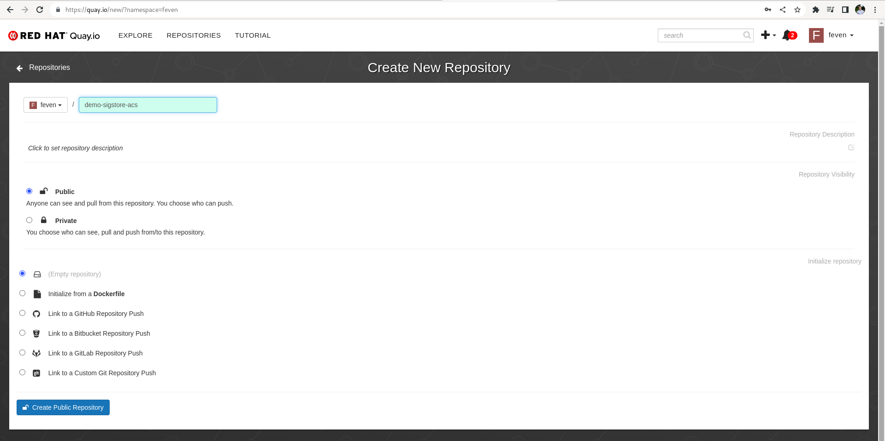

# cicd-e2e-lab-deploy

This repo contains the material to deploy a cicd chain on openshift.


## Deploy ArgoCD, cluster-wide subscriptions and create namespaces

```shell
oc apply -f gitops/sub.yaml
oc apply -f gitops/ns.yaml
oc apply -f gitops/ClusterRoleBinding.yaml 
```

## Quay configuration and credentials setup

In quay.io create a public repository, that will be used to store the image build by the pipeline.



Then create a robot accound that will be used by the pipeline service account in openshift.

Click on your username on the top left > Account settings > Robot Accounts > Create Robot Account > Provide a name for your bot > select the repo that we have create in the previous step > Select admin permission. 

Then click on Robot Account and copy the username and the password. 


```shell
export QUAY_TOKEN="XXX"
export EMAIL="XXX"
export USERNAME="feven+acs_integration"
export NAMESPACE="cicd-devsec-ops"
```

Create a namespace and the secret for the registry

```shell
oc create ns ${NAMESPACE}
oc create secret  docker-registry registry-credentials  --docker-server=quay.io --docker-username=${USERNAME} --docker-email=${EMAIL} --docker-password=${QUAY_TOKEN} -n ${NAMESPACE}
```

Patch the service account to get access to the creds

- Patch build-bot
```shell
oc patch serviceaccount  \
  -p "{\"imagePullSecrets\": [{\"name\": \"registry-credentials\"}]}" -n ${NAMESPACE}
```


- GITEA WEBHOOK SECRET
```yaml
apiVersion: v1
kind: Secret
metadata:
  name: gitea-bot-token
  namespace: cicd-devsec-ops
type: Opaque
stringData:
  token: CHANGE_ME
```
- GITEA TOKEN
```yaml
apiVersion: v1
kind: Secret
metadata:
  name: cicd-devsec-ops-githook-secret
  namespace: cicd-devsec-ops
type: Opaque
stringData:
  GIT_HOOK_SECRET: CHANGE_ME
```
- Cosign key
```shell
cosign generate-key-pair k8s://openshift-pipelines/signing-secrets
```

## Configure the cicd chain

Create the argoCD chain project
```shell
oc apply -f gitops/argocd/project.yaml
```

Create the argoCD Application
```shell
oc apply -f gitops/argocd/application.yaml
```
