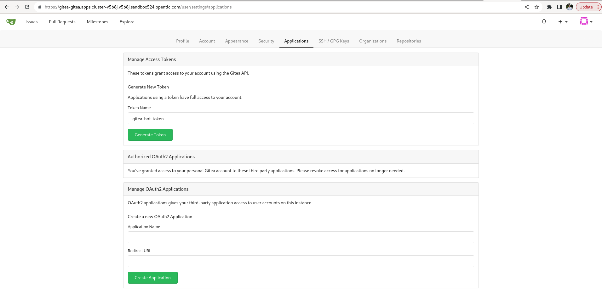
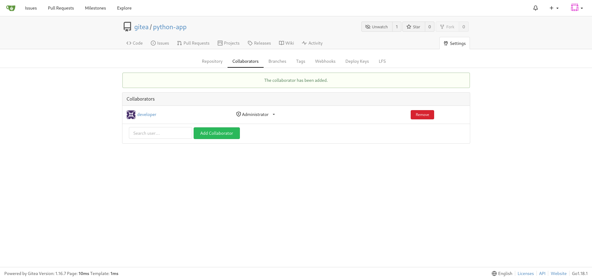
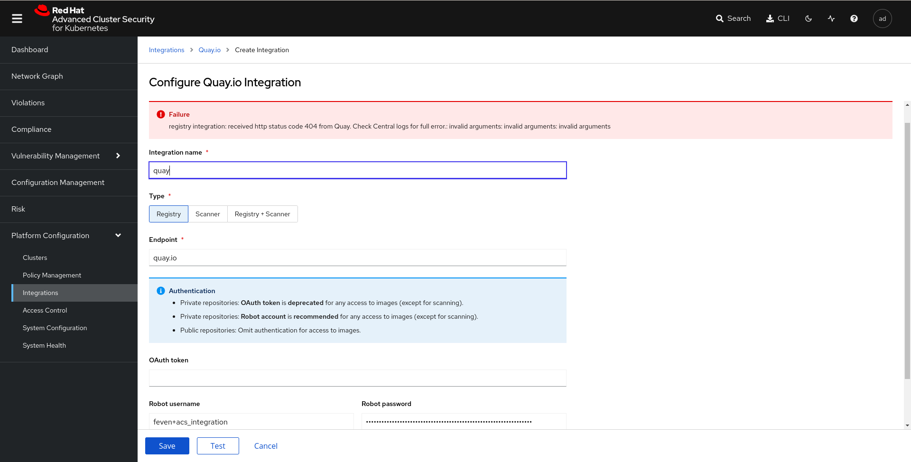
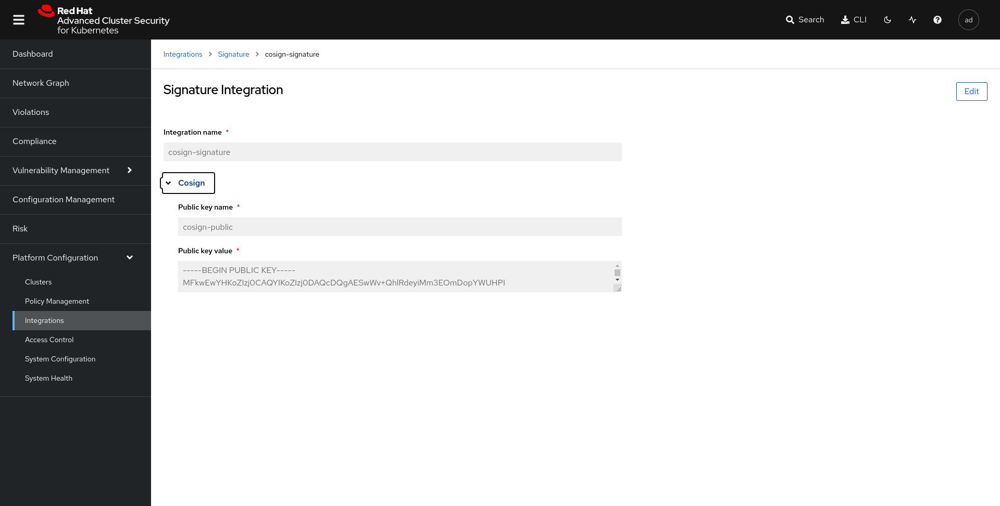

# cicd-e2e-lab-deploy

This repo contains the material to deploy a cicd chain on openshift.


## Deploy ArgoCD, cluster-wide subscriptions and create namespaces

```shell
oc apply -f gitops/sub.yaml
oc apply -f gitops/ns.yaml
oc apply -f gitops/ClusterRoleBinding.yaml 
```

## Quay configuration and credentials setup

In quay.io create a public repository, that will be used to store the image build by the pipeline.


Then create a robot accound that will be used by the pipeline service account in openshift.

Click on your username on the top left > Account settings > Robot Accounts > Create Robot Account > Provide a name for your bot > select the repo that we have create in the previous step > Select admin permission. 

Then click on Robot Account and Download credentials config


```shell
export QUAY_TOKEN="XXX"
export EMAIL="XXX"
export USERNAME="feven+acs_integration"
export NAMESPACE="cicd-devsec-ops"
```

Create a namespace and the secret for the registry

```shell
oc create secret generic registry-credentials --from-file=config.json -n ${NAMESPACE}
```

Replace ROOT_URL with your correct base domain in :
```shell
./cicd-devsec-ops/gitops/base/gitea/gitea-server.yaml
```
And replace GITEA_HOST_URL with your correct base domain :
```shell
./cicd-devsec-ops/gitops/base/pipeline/02_trigger-template.yaml 
```

Then replace quay.io/feven by the name of your own repo in
```shell
~/cicd-devsec-ops/gitops/base/pipeline/02_trigger-template.yaml
```
and
```shell
/home/feven/Desktop/SA/cicd-devsec-ops/gitops/base/pipeline/07_task-sign-image.yaml
```

## Configure the cicd chain

Create the argoCD chain project
```shell
oc apply -f gitops/argocd/project.yaml
```

Create the argoCD Application
```shell
oc apply -f gitops/argocd/application.yaml
```

## Post configuration

### Gitea configuration

At first we need to configure our gitea account and push a repository.

Get the URL for the Gitea route:
```shell
GITEA_URL=$(echo "https://$(oc get route gitea -o=jsonpath='{.spec.host}' -n gitea)")
```

Connect to gitea using gitea and redhat123.

At first we will create an Access Tokens to get access to the gitea API.

On the top right select the gitea icons and click on settings. Then go in applications. Put gitea-bot-token as token name and click on Generate Token.



Copy the generate token and create the following gitea secret:


```yaml
cat <<EOF | oc apply -f -
apiVersion: v1
kind: Secret
metadata:
  name: gitea-bot-token
  namespace: cicd-devsec-ops
type: Opaque
stringData:
  token: 43d1db62909b1346e34a95a48d1256498c2b108e
EOF
```

Now on the top right click on the + and click on New repository. Give python-app as name, and keep other default parameters. Click on Create Repository. 

Then click on settings > Collaborators and add Developer Collaborator with Administrator right.



Then clone the following repo https://github.com/adrien-legros/openshift-pipelines-demo and change the remote origin
```shell
git remote set-url origin $GITEA_URL/gitea/python-app.git
git add --all
git commit -m "init repo in gitea"
git push
#use gitea redhat123
```


Patch the service account to get access to the creds

- Patch build-bot
```shell
oc patch serviceaccount build-bot \
  -p "{\"imagePullSecrets\": [{\"name\": \"registry-credentials\"}]}" -n ${NAMESPACE}
```

- GITEA TOKEN

```yaml
cat <<EOF | oc apply -f -
apiVersion: v1
kind: Secret
metadata:
  name: cicd-devsec-ops-githook-secret
  namespace: cicd-devsec-ops
type: Opaque
stringData:
  GIT_HOOK_SECRET: $(echo $RANDOM | md5sum | cut -d" " -f1)
EOF
```

Get the GIT_HOOK_SECRET Genereated.

```shell
oc get secret cicd-devsec-ops-githook-secret -n cicd-devsec-ops -oyaml | grep stringData
```


Create webhook. Click on your application then go on setting > Webhooks and click on add Webhook. Then click on Gitea.

In Target url put the url of the event listener 
```shell
echo "https://$(oc get route el-cicd-devsec-ops-listener -o=jsonpath='{.spec.host}' -n cicd-devsec-ops)"
```
and put the git_hook_secret generated previously.

In trigger On select Custom Events and click on Pull Request. Finally click on Add Webhook

### RHACS configuration

Go in RHACS 

```shell
echo "https://$(oc get route central -o=jsonpath='{.spec.host}' -n rhacs-operator)"
```

Connect using admin as user and get password with the following command:

```shell
oc -n rhacs-operator get secret central-htpasswd -o go-template='{{index .data "password" | base64decode}}'
```

Go in platform configuration > Integrations and select api token.

Click on Generate Token. Choose a token name and select continuous Integration as Role.
Copy the Api Token Integration and create the integration secret.

```shell
ROX_API_TOKEN=<YOURTOKEN>
ACS_ROUTE=$(echo "$(oc get route central -o=jsonpath='{.spec.host}' -n rhacs-operator)")
cat > /tmp/roxsecret.yaml << EOF
apiVersion: v1
data:
  rox_api_token: "$(echo $ROX_API_TOKEN | tr -d '\n' | base64 -w 0)"
  rox_central_endpoint: "$(echo $ACS_ROUTE:443 | tr -d '\n' | base64 -w 0)"
kind: Secret
metadata:
  name: rox-api-token
  namespace: ${NAMESPACE}
type: Opaque
EOF

oc apply -f /tmp/roxsecret.yaml
```
Toujours dans ACS passe la policy Fixable Severity at least Important de Enforce a Informative.


## Quay and cosign integration

At first we need to allow scan of quay image in ACS:

Then we will create a task that gonna use ACS api to check that the image is signed. 

To do that go in the ACS GUI > Integrations > Quay.io > New integration and provide the quay.io credentials that has been generated previously :



Then we will add the cosign publickey in rhacs to allow the checking.

Create a cosign key

```shell
cosign generate-key-pair k8s://openshift-pipelines/signing-secrets
```
Get the public key
```shell
oc -n openshift-pipelines get secret signing-secrets -o go-template='{{index .data "cosign.pub" | base64decode}}'
```

Go in integrations signature and provide the key value.



Then we need to create a stackrox policy that will check sigstore signature.

Go in Policy Management > Import policy and paste the following json file

```shell
{
    "policies": [
        {
            "id": "c8fde2c3-980c-40e3-bc9d-6245b13ab81e",
            "name": "Trusted_Signature_Image_Policy",
            "description": "Alert on Images that have not been signed",
            "rationale": "rationale",
            "remediation": "All images should be signed by our cosign-demo signature",
            "disabled": false,
            "categories": [
                "Security Best Practices"
            ],
            "lifecycleStages": [
                "BUILD",
                "DEPLOY"
            ],
            "severity": "HIGH_SEVERITY",
            "enforcementActions": [],
            "notifiers": [],
            "SORTName": "",
            "SORTLifecycleStage": "",
            "SORTEnforcement": true,
            "policyVersion": "1.1",
            "policySections": [
                {
                    "sectionName": "Policy Section 1",
                    "policyGroups": [
                        {
                            "fieldName": "Image Signature Verified By",
                            "booleanOperator": "OR",
                            "negate": false,
                            "values": [
                                {
                                    "value": "io.stackrox.signatureintegration.f9352803-d5c9-45d6-abe0-e1361a24559a"
                                }
                            ]
                        }
                    ]
                }
            ],
            "mitreAttackVectors": [],
            "criteriaLocked": false,
            "mitreVectorsLocked": false,
            "isDefault": false
        }
    ]
}
```

Click on begin import

# Triger the pipeline

Now You can trigger the pipeline 
To do that go in gitea and log with the user developer redhat123. 
You should see the repo python-app.
Click on Fork on the top right and select Fork Repository.
Click on it and go in app.py and click on edit file.
Replace random_string by hello instead of e and click on commit changes.
Nos click on Pull Requests > New Pull Request.
On The left select merge into: gitea:main.
Click on New Pull Request.
Then you should see in openshift that the pipeline as been triggered


